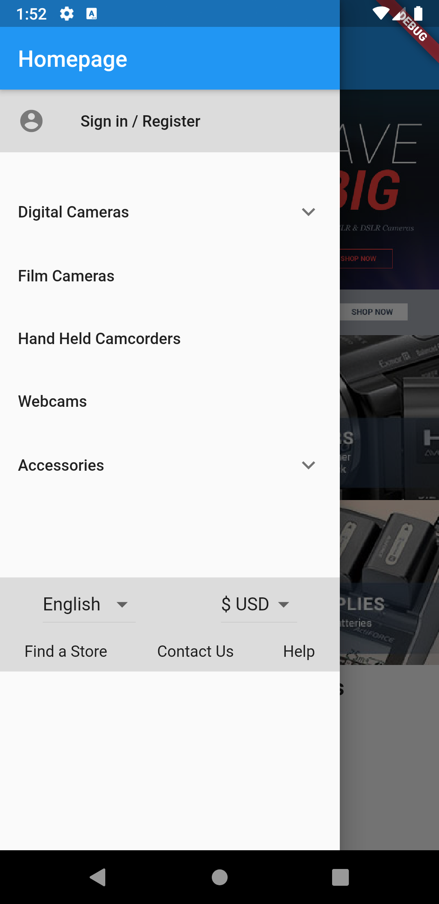
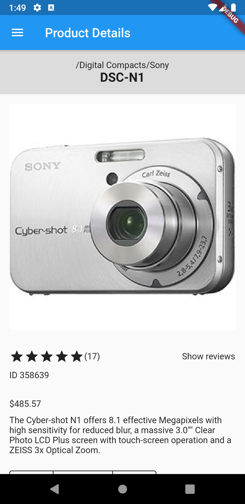
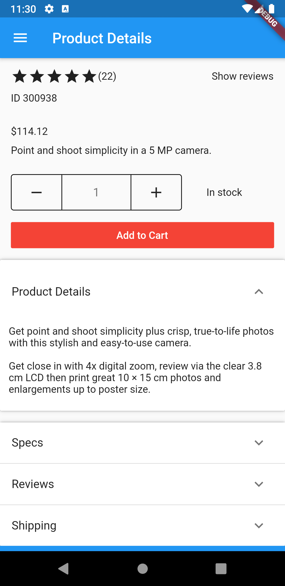
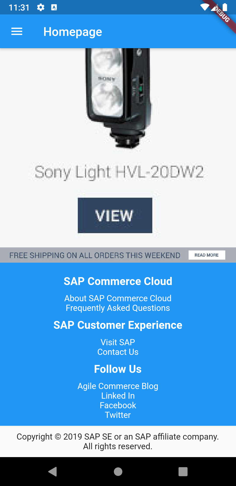
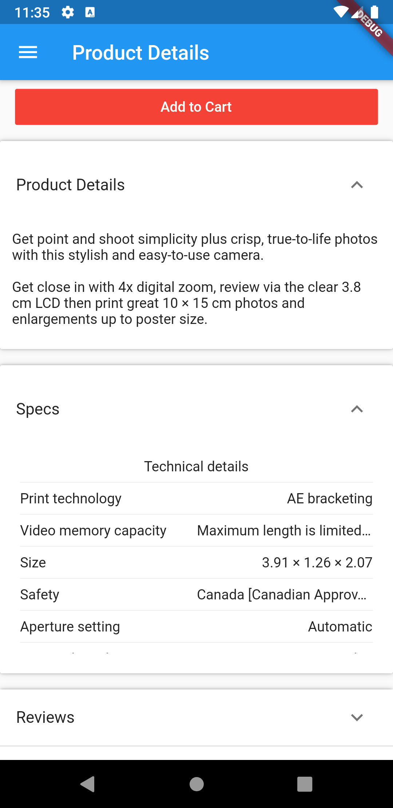

# What is Crixus?

Crixus is a sample Flutter based storefront for SAP Commerce Cloud,
making use of its REST API (OCC) to retrieve data.

<p align="middle">



</p>

## How does it work?

SAP Commerce Cloud instances expose a number of REST endpoints / functionalities
via the in Commerce included
[Omni Commerce Connect (OCC) layer](https://help.sap.com/viewer/9d346683b0084da2938be8a285c0c27a/1905/en-US/8c19ab00866910148f87bf32d4a60d38.html),
which are used by SAP's angular based headless storefront - [Spartacus](https://github.com/SAP/spartacus).

This demo Flutter based storefront application makes use of those endpoints to fetch
CMS-content for the current page the customer is on, as well as product-
and any additional data required.

### How are pages structured

Each screen is made up of a number of content slots, as can be seen by
retrieving the pages json via SAP Commerces OCC REST-API:

```json
{
   "uid": "homepage",
   "title": "Homepage",
   "contentSlots": {
      "contentSlot": [
         {
            "slotId": "Section3Slot-Homepage",
            "position": "Section3",
            "name": "Section3 Slot for Homepage",
            "components": {
            }
         },
         {
            "slotId": "Section2BSlot-Homepage",
            "position": "Section2B",
            "name": "Section2B Slot for Homepage",
            "components": {
            }
          }
      ]
    }
}
```

The content slots retrieved per page can then be aligned using their position
as unique id within the corresponding screens inside the Flutter application.

```dart
    return SingleChildScrollView(
      child: Column(
        children: <Widget>[
          ContentSlot(currentPage.getContentSlotForPosition('Section1')),
          Row(
            children: <Widget>[
              Container(
                  width: width * 0.5,
                  child: ContentSlot(
                      currentPage.getContentSlotForPosition('Section2A'))),
              Container(
                  width: width * 0.5,
                  child: ContentSlot(
                      currentPage.getContentSlotForPosition('Section2B'))),
            ],
          ),
          ContentSlot(currentPage.getContentSlotForPosition('Section3')),
          ContentSlot(currentPage.getContentSlotForPosition('Section4')),
          ContentSlot(currentPage.getContentSlotForPosition('Section5')),
          ContentSlot(currentPage.getContentSlotForPosition('Footer')),
        ],
      ),
    );
```

All to a slot assigned components are then rendered within the content slots
container, extending the parents styling. A detailed list of supported components
can be found below.

### How are components rendered

Each component found within the response of the OCC layers interfaces contains
a *typeCode*, telling the application which widget shall be used for rendering it.

```json
{
  "uid": "SiteLogoComponent",
  "typeCode": "SimpleBannerComponent",
  "modifiedTime": "2020-04-23T21:36:43.75Z",
  "name": "Site Logo Component",
  "container": "false",
  "external": "false",
  "media": {
    "code": "/images/theme/SAP_scrn_R.png",
    "mime": "image/png",
    "altText": "SAP Commerce",
    "url": "/medias/SAP-scrn-R.png?context=bWFzdGVyfGltYWdlc3wxMDEyN3xpbWFnZS9wbmd8aGZhL2g2OS84Nzk3NjY5NTIzNDg2L1NBUF9zY3JuX1IucG5nfDkzZmMzOTQ0OGM1NmQzODI2NTRmNzMwMzQzNWUxZWNiYTNiNTNlM2FjNGQxYmIyOWU0YTllMzJiYjZjNjFiYjQ"
  },
   "urlLink": "/"
}
```

The corresponding Flutter widget is parsed from the components json
including the contained attributes. If necessary subsequent calls to the
SAP Commerce backend are done if further data needs to be retrieved.

```dart
class SimpleResponsiveBannerComponent extends StatelessWidget {
  final String uid;

  final String name;

  final List<MediaModel> media;

  SimpleResponsiveBannerComponent({this.uid, this.name, this.media});

  @override
  Widget build(BuildContext context) {
    return Container(
      width: double.infinity,
      child: FittedBox(
        child: Image.network(
          MediaService.getMediaForCurrentViewPort(media, context).url,
        ),
      ),
    );
  }

  factory SimpleResponsiveBannerComponent.fromJSON(
      final Map<String, dynamic> json) {
    List<MediaModel> allMedias = List();

    json['media'].forEach((mediaFormat, mediaJson) =>
        allMedias.add(MediaModel.fromJson(mediaFormat, mediaJson)));

    return SimpleResponsiveBannerComponent(
      uid: json['uid'],
      name: json['name'],
      media: allMedias,
    );
  }
}
```

## Configuration

### Properties

Configuration of the application is done by configuring the environment
json to be used for fetching environment variables from. The configurations
can be found within the *assets/config* directory.

```dart
Future<void> main() async {
  WidgetsFlutterBinding.ensureInitialized();
  final config = await AppConfig.forEnvironment("env-dev");
  GetIt.I.registerSingleton<AppConfig>(config);
  runApp(MyApp());
}
```

The application requires a running commerce server from which data can
be retrieved. Configuration of the host as well as used website is done
within the environment.

```json
{
  "sapCommerceHost": "https://localhost:9002",
  "sapCommerceWebsite": "electronics-spa",
  "debugModeEnabled": false
}
```

### Localization

Localization of any texts used within the application that is not fetched via the OCC backend
can be maintained within the corresponding languages json file found under *assets/i18n*

```json
{
  "login.register.title": "Anmelden / Registrieren",
  "button.add.to.cart": "Zum Warenkorb hinzufügen",
  "stocklevel.status.instock": "Verfügbar",
  "text.show.reviews": "Reviews anzeigen",
  "text.loading": "Lädt..."
}
```

## Available SAP Commerce Components

The following components are available within the demo project
and have mapped Flutter widgets used for rendering them. Any missing
components are not shown by default. Enabling the *debugModeEnabled*
flag renders a placeholder with the missing item type.

<p align="middle">




</p>

```dart
class ComponentFactory {
  static Widget getComponentFromJSON(final Map<String, dynamic> json) {
    String typeCode = json['typeCode'];
    switch (typeCode) {
      case 'SimpleResponsiveBannerComponent':
        return SimpleResponsiveBannerComponent.fromJSON(json);
      case 'ProductCarouselComponent':
        return ProductCarouselComponent.fromJSON(json);
      case 'CMSParagraphComponent':
        return CMSParagraphComponent.fromJSON(json);
      case 'CMSLinkComponent':
        return CMSLinkComponent.fromJSON(json);
      case 'FooterNavigationComponent':
        return FooterNavigationComponent.fromJSON(json);
      case 'BreadcrumbComponent':
        return BreadcrumbComponent.fromJSON(json);
      case 'ProductIntroComponent':
        return ProductIntroComponent.fromJSON(json);
      case 'ProductImagesComponent':
        return ProductImagesComponent.fromJSON(json);
      case 'ProductSummaryComponent':
        return ProductSummaryComponent.fromJSON(json);
      case 'ProductAddToCartComponent':
        return ProductAddToCartComponent.fromJSON(json);
      case 'CMSTabParagraphContainer':
        return CMSTabParagraphContainer.fromJSON(json);
      case 'CMSTabParagraphComponent':
        return CMSTabParagraphComponent.fromJSON(json);
      case 'ProductDetailsTabComponent':
        return ProductDetailsTabComponent.fromJSON(json);
      case 'ProductReviewsTabComponent':
        return ProductReviewsTabComponent.fromJSON(json);
      case 'ProductSpecsTabComponent':
        return ProductSpecsTabComponent.fromJSON(json);
      case 'CategoryNavigationComponent':
        return CategoryNavigationComponent.fromJSON(json);
      case 'CMSFlexComponent':
        return CMSFlexComponent.fromJSON(json);
      default:
        return getMissingComponentPlaceholder(typeCode);
    }
  }

  static Widget getMissingComponentPlaceholder(String typeCode) {
    return GetIt.I<AppConfig>().debugModeEnabled
        ? Text('Unkown component: $typeCode')
        : Container();
  }
}
```